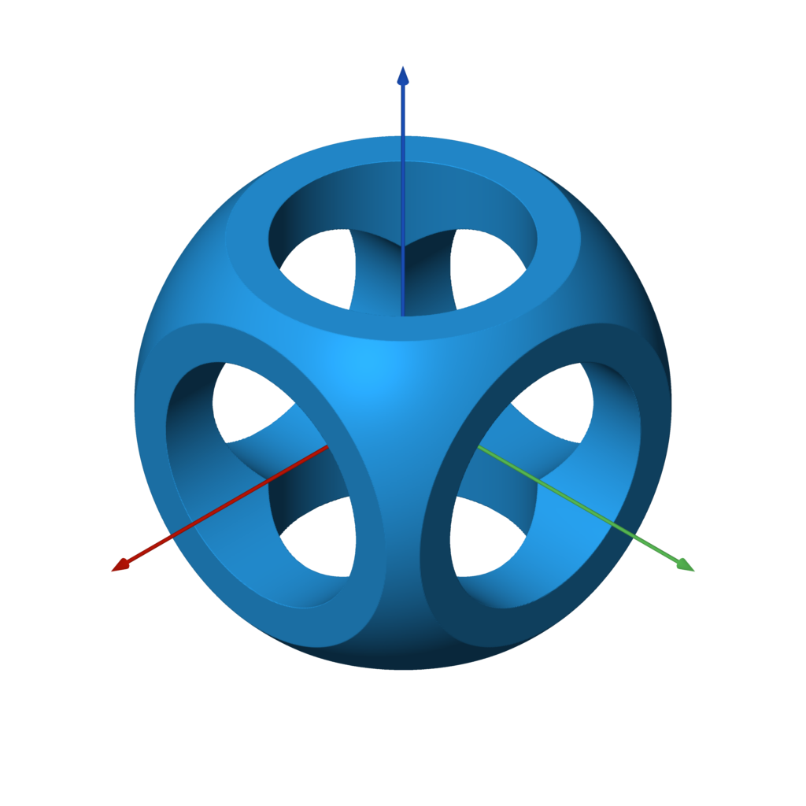

# sdf

Generate 3D meshes (STLs) based on SDFs (signed distance functions) with a
dirt simple Python API.

Special thanks to [Inigo Quilez](https://iquilezles.org/) for his excellent documentation on signed distance functions:

- [3D Signed Distance Functions](https://iquilezles.org/www/articles/distfunctions/distfunctions.htm)
- [2D Signed Distance Functions](https://iquilezles.org/www/articles/distfunctions2d/distfunctions2d.htm)

## Example

Here is a complete example that generates the model shown below. This is the
canonical [Constructive Solid Geometry](https://en.wikipedia.org/wiki/Constructive_solid_geometry)
example.

```python
from sdf import *

f = sphere(1) & box(1.5)

c = cylinder(0.5)
f -= c.orient(X) | c.orient(Y) | c.orient(Z)

f.save('out.stl')
```

Yes, that's really the entire code! You can 3D print that model or use it
in a 3D game.



## Requirements

Note that the dependencies will be automatically installed by setup.py when
following the directions below.

- Python 3
- numpy
- scikit-image

## Installation

Use the commands below to clone the repository and install the `sdf` library
in a Python virtualenv.

```bash
git clone https://github.com/fogleman/sdf.git
cd sdf
virtualenv env
. env/bin/activate
pip install -e .
```

Confirm that it works:

```bash
python example.py # should generate a file named out.stl
```

You can skip the installation if you always run scripts that import `sdf`
from the root folder.

## How it Works

The code simply uses the [Marching Cubes](https://en.wikipedia.org/wiki/Marching_cubes)
algorithm to generate a mesh from the [Signed Distance Function](https://en.wikipedia.org/wiki/Signed_distance_function).

This would normally be abysmally slow in Python. However, numpy is used to
evaluate the SDF on entire batches of points simultaneously. Furthermore,
multiple threads are used to process batches in parallel. The result is
surprisingly fast. Meshes of adequate detail can still be quite large in
terms of number of triangles.

The core "engine" of the `sdf` library is very small and can be found in
[mesh.py](https://github.com/fogleman/sdf/blob/main/sdf/mesh.py).

In short, there is nothing algorithmically revolutionary here. The goal is
to provide a simple, fun, and easy-to-use API for generating 3D models in our
favorite language Python.

## Files

- [sdf/d2.py](https://github.com/fogleman/sdf/blob/main/sdf/d2.py): 2D signed distance functions
- [sdf/d3.py](https://github.com/fogleman/sdf/blob/main/sdf/d3.py): 3D signed distance functions
- [sdf/dn.py](https://github.com/fogleman/sdf/blob/main/sdf/dn.py): Dimension-agnostic signed distance functions
- [sdf/ease.py](https://github.com/fogleman/sdf/blob/main/sdf/ease.py): [Easing functions](https://easings.net/) that operate on numpy arrays. Some SDFs take an easing function as a parameter.
- [sdf/mesh.py](https://github.com/fogleman/sdf/blob/main/sdf/mesh.py): The core mesh-generation engine. Also includes code for estimating the bounding box of an SDF and for plotting a 2D slice of an SDF with matplotlib.
- [sdf/progress.py](https://github.com/fogleman/sdf/blob/main/sdf/progress.py): A console progress bar.
- [sdf/stl.py](https://github.com/fogleman/sdf/blob/main/sdf/stl.py): Code for writing a binary [STL file](https://en.wikipedia.org/wiki/STL_(file_format)).
- [sdf/util.py](https://github.com/fogleman/sdf/blob/main/sdf/util.py): Utility constants and functions.

## Bounds

The bounding box of the SDF is automatically estimated. Inexact SDFs such as
non-uniform scaling may cause issues with this process. In that case you can
specify the bounds manually:

```python
f.save('out.stl', bounds=((-1, -1, -1), (1, 1, 1)))
```

## Resolution

The resolution of the mesh is also handled automatically. There are two ways
to specify the resolution. You can set the resolution directly with `step`:

```python
f.save('out.stl', step=0.01)
f.save('out.stl', step=(0.01, 0.02, 0.03)) # non-uniform resolution
```

Or you can specify approximately how many points to sample:

```python
f.save('out.stl', samples=2**24) # sample about 16M points
```

By default, `samples=2**22` is used.

## Batches

The SDF is sampled in batches. By default the batches have `32**3 = 32768`
points each. This batch size can be overridden:

```python
f.save('out.stl', batch_size=64) # instead of 32
```

The code attempts to skip any batches that are far away from the surface of
the mesh. Inexact SDFs such as non-uniform scaling may cause issues with this
process, resulting in holes in the output mesh (where batches were skipped when
they shouldn't have been). To avoid this, you can disable sparse sampling:

```python
f.save('out.stl', sparse=False) # force all batches to be completely sampled
```

### Worker Threads

The SDF is sampled in batches using worker threads. By default,
`multiprocessing.cpu_count()` worker threads are used. This can be overridden:

```python
f.save('out.stl', workers=1) # only use one worker thread
```

## Functions
